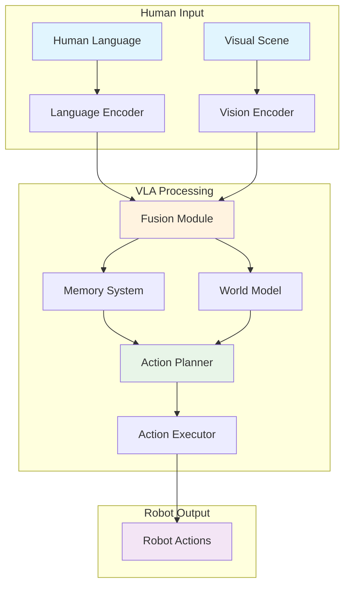

# Vision-Language-Action (VLA) Systems for Humanoid Robotics

## Introduction

Vision-Language-Action (VLA) systems represent a paradigm shift in robotics, where visual perception, natural language understanding, and robotic action execution are tightly integrated to enable more intuitive and capable robotic systems. This integration allows robots to understand complex human instructions, perceive their environment, and execute sophisticated tasks in a coordinated manner.

For humanoid robotics, VLA systems are particularly important as they enable robots to interact naturally with humans and their environments using multiple modalities simultaneously. This chapter explores the convergence of these three critical components and how they work together to create embodied intelligence.

## The Three Modalities of VLA Systems

### Vision Processing

Vision processing in VLA systems goes beyond simple object detection to include:

- **Scene Understanding**: Comprehending the spatial relationships between objects and understanding the context of the environment
- **Visual Question Answering**: Answering questions about the visual scene that require both perception and reasoning
- **Visual Grounding**: Connecting visual elements with language concepts, allowing robots to understand references like "the red cup on the table"

Key components of vision processing include:
- Object detection and recognition
- Depth estimation and 3D scene reconstruction
- Semantic segmentation
- Visual tracking and motion analysis

### Language Understanding

Language understanding in VLA systems encompasses:

- **Natural Language Processing**: Converting human language into structured representations that robots can process
- **Intent Extraction**: Identifying the underlying goals and intentions behind human commands
- **Contextual Reasoning**: Understanding language in the context of the visual scene and robot capabilities

The language component must handle various forms of human communication:
- Direct commands ("Pick up the red cup")
- Descriptive requests ("Bring me something to drink")
- Complex multi-step instructions
- Conversational interactions

### Action Execution

Action execution involves:

- **Task Planning**: Breaking down high-level goals into sequences of executable actions
- **Motion Planning**: Determining how to physically execute actions while avoiding obstacles
- **Control Execution**: Sending commands to robot actuators to perform physical movements
- **Feedback Integration**: Using sensory information to adjust actions in real-time

## Convergence in Embodied Intelligence

The true power of VLA systems emerges when these three modalities converge to create embodied intelligence:

### Multi-Modal Integration

VLA systems integrate information from all three modalities simultaneously:

- Visual information informs language understanding (e.g., disambiguating "the cup" based on what's visible)
- Language provides high-level goals and context for visual processing
- Action execution is guided by both visual perception and language commands

### Closed-Loop Interaction

VLA systems operate in a closed-loop manner:

1. **Perception**: The robot observes its environment
2. **Understanding**: Visual and linguistic information is processed
3. **Planning**: Actions are planned based on goals and current state
4. **Execution**: Actions are performed in the environment
5. **Feedback**: New observations inform the next cycle

### Learning from Interaction

VLA systems can learn from their interactions:

- **Reinforcement Learning**: Learning which action sequences lead to successful outcomes
- **Imitation Learning**: Learning from human demonstrations that combine visual, linguistic, and action components
- **Language-Guided Learning**: Using language to specify what to learn and how to evaluate success

## Applications in Humanoid Robotics

VLA systems enable humanoid robots to perform complex tasks that require understanding both language commands and visual scenes:

### Human-Robot Interaction

- Understanding natural language commands in the context of the current environment
- Providing verbal feedback about actions and observations
- Engaging in contextual conversations about tasks and goals

### Complex Task Execution

- Following multi-step instructions that require understanding both language and visual context
- Adapting to unexpected situations by combining visual perception with flexible planning
- Performing tasks in dynamic environments where both visual and linguistic information change

### Social Navigation

- Understanding social cues from both visual and linguistic inputs
- Navigating in human-populated environments while respecting social norms
- Responding appropriately to social interactions during task execution

## Embodied Intelligence Systems

Embodied intelligence refers to the concept that intelligence emerges from the interaction between an agent and its environment. In the context of VLA systems, embodied intelligence means that the robot's understanding and decision-making capabilities are enhanced by its physical presence and interaction with the world.

### Key Principles of Embodied Intelligence

1. **Embodiment**: The robot's physical form and sensorimotor capabilities shape its understanding of the world
2. **Situatedness**: Intelligence is context-dependent and emerges from interaction with the environment
3. **Emergence**: Complex behaviors arise from simple sensorimotor interactions
4. **Coupling**: Tight integration between perception, cognition, and action

### Embodied Intelligence in VLA Systems

In VLA systems, embodied intelligence manifests through:

#### Perceptual Grounding
- Language understanding grounded in visual and physical experiences
- Actions informed by real-world sensory feedback
- Learning from physical interaction with objects and environments

#### Active Perception
- The robot actively seeks information by moving sensors and changing viewpoints
- Visual attention guided by linguistic context and task goals
- Selective processing of sensory information based on relevance

#### Interactive Learning
- Learning through physical interaction with the environment
- Language as a tool for learning and instruction
- Social learning through human-robot interaction

### Benefits of Embodied Intelligence

#### Enhanced Understanding
Embodied systems can develop deeper understanding by connecting abstract concepts to physical experiences:

- Understanding "heavy" through lifting objects
- Learning spatial relationships through navigation
- Grasping affordances through manipulation

#### Adaptive Behavior
Embodied systems can adapt to novel situations by leveraging their physical capabilities:

- Improvising solutions when standard approaches fail
- Learning from trial and error in real environments
- Developing robust behaviors through physical interaction

#### Natural Interaction
Embodied systems can interact more naturally with humans and environments:

- Understanding human actions and intentions through observation
- Responding appropriately to social cues
- Participating in collaborative tasks

### Challenges in Embodied Intelligence

#### Real-World Complexity
- Dealing with uncertainty and noise in sensory inputs
- Handling dynamic and unpredictable environments
- Managing the complexity of real-world physics

#### Learning Efficiency
- Balancing exploration with exploitation
- Transferring learning across different contexts
- Scaling learning to complex real-world tasks

#### Safety and Reliability
- Ensuring safe behavior in human environments
- Handling failures gracefully
- Maintaining reliable operation over extended periods

## Technical Architecture

A typical VLA system architecture includes:

```
[Human Language Input] → [Language Encoder] → [Fusion Module] → [Action Planner]
                              ↑                      ↓              ↓
[Visual Input] → [Vision Encoder] → [Memory] → [World Model] → [Action Executor]
```

### Visual Architecture Diagram



### Key Components

1. **Modality Encoders**: Convert raw inputs (images, text) into feature representations
2. **Fusion Mechanisms**: Combine information from different modalities
3. **Memory Systems**: Store and retrieve relevant information for decision making
4. **Action Planners**: Generate sequences of actions to achieve goals
5. **World Models**: Maintain understanding of the current state and predict outcomes

## Challenges and Considerations

### Real-Time Processing

VLA systems must process multiple modalities in real-time while maintaining responsive interaction with humans.

### Robustness

Systems must handle variations in lighting, language, and environmental conditions.

### Safety

Integration of multiple complex systems requires careful attention to safety protocols and fallback mechanisms.

## Examples of Vision-Language-Action Integration

To illustrate how VLA systems work together, let's examine some concrete examples:

### Example 1: Object Retrieval Task

```python
# Example of VLA integration for retrieving an object
def retrieve_object_task(robot, command):
    """
    Example: "Please bring me the red cup from the kitchen"
    """
    # Vision component: Detect objects in the environment
    vision_data = robot.vision_system.capture_scene()
    objects = robot.vision_system.detect_objects(vision_data)

    # Language component: Parse the command to extract intent
    intent = robot.language_system.parse_command(command)
    # Result: {"action": "retrieve", "object": "red cup", "location": "kitchen"}

    # Action component: Plan and execute the retrieval
    if intent["action"] == "retrieve":
        # Find the red cup in the kitchen
        target_object = find_object_by_attributes(
            objects,
            color="red",
            type="cup",
            location=intent["location"]
        )

        if target_object:
            # Plan navigation to kitchen
            navigation_action = robot.action_planner.plan_navigation(
                target_location=intent["location"]
            )

            # Plan grasping action
            grasp_action = robot.action_planner.plan_grasp(
                object_info=target_object
            )

            # Execute the sequence
            robot.execute_action_sequence([
                navigation_action,
                grasp_action,
                robot.action_planner.plan_return()
            ])
        else:
            robot.speak("I couldn't find the red cup in the kitchen.")

def find_object_by_attributes(objects, color=None, type=None, location=None):
    """
    Helper function to find objects matching specific attributes
    """
    for obj in objects:
        if color and obj.color != color:
            continue
        if type and obj.type != type:
            continue
        if location and not obj.in_location(location):
            continue
        return obj
    return None
```

### Example 2: Multi-Modal Command Processing

```python
class VLASystem:
    def __init__(self):
        self.vision_system = VisionSystem()
        self.language_system = LanguageSystem()
        self.action_system = ActionSystem()
        self.fusion_module = FusionModule()

    def process_command(self, command, visual_context):
        """
        Process a command using visual and linguistic inputs
        """
        # Process visual input
        vision_features = self.vision_system.encode(visual_context)

        # Process language input
        language_features = self.language_system.encode(command)

        # Fuse modalities
        fused_features = self.fusion_module.fuse(vision_features, language_features)

        # Generate action plan
        action_plan = self.action_system.generate_plan(fused_features)

        # Execute action
        result = self.action_system.execute(action_plan)

        return result

# Usage example
vla_system = VLASystem()
command = "Go to the person wearing a blue shirt and ask them how they're doing"
visual_context = camera.get_current_frame()
result = vla_system.process_command(command, visual_context)
```

### Example 3: Closed-Loop VLA Interaction

```python
def closed_loop_vla_interaction(robot, goal_command):
    """
    Continuous interaction loop with VLA system
    """
    max_iterations = 10
    iteration = 0

    while iteration < max_iterations:
        # Perceive environment
        visual_input = robot.sensors.get_visual_input()
        current_state = robot.get_current_state()

        # Update world model
        robot.world_model.update(visual_input, current_state)

        # Process goal with current context
        action = robot.vla_system.decide_action(
            goal=goal_command,
            current_context=robot.world_model.get_context()
        )

        # Execute action
        execution_result = robot.execute(action)

        # Check if goal is achieved
        if robot.goal_checker.is_achieved(goal_command, robot.world_model):
            robot.speak("Goal achieved!")
            break

        # Check if action failed and needs replanning
        if not execution_result.success:
            robot.speak("Encountered an issue, replanning...")
            continue

        iteration += 1

    if iteration >= max_iterations:
        robot.speak("Max iterations reached, goal not achieved.")

# Example usage
robot = HumanoidRobot()
closed_loop_vla_interaction(robot, "Set the table for dinner with plates and glasses")
```

## How Vision, Language, and Action Work Together

### Example: Setting a Dinner Table

Let's examine a more complex example that shows how all three VLA components work together to accomplish the task "Set the table for dinner with plates and glasses":

#### Step 1: Language Understanding
The language component receives the command and breaks it down:
- **Goal**: Set the table for dinner
- **Objects needed**: plates, glasses
- **Context**: dinner setting

#### Step 2: Vision Processing
The vision system surveys the dining area:
- **Current state**: Table is empty
- **Available objects**: Plates in kitchen cabinet, glasses in cupboard
- **Spatial layout**: Location of table, kitchen, and dining area

#### Step 3: Action Planning
The action system creates a plan based on the integrated information:
1. Navigate to kitchen
2. Detect and locate plates
3. Grasp plates
4. Navigate to dining table
5. Place plates at table positions
6. Return to kitchen
7. Detect and locate glasses
8. Grasp glasses
9. Navigate to dining table
10. Place glasses at table positions

#### Step 4: Execution with Feedback
During execution, the system continuously integrates information:
- Vision confirms successful grasping of plates
- Language system clarifies if only two plates are needed (for two people)
- Action system adjusts placement based on table size and shape

### Example 4: Multi-Modal Integration for Complex Tasks

```python
def set_dinner_table(robot, command):
    """
    Example: "Set the table for dinner with plates and glasses"
    """
    # Language component parses the command
    parsed_command = robot.language_system.parse(command)
    # Result: {"task": "set_table", "objects": ["plates", "glasses"], "occasion": "dinner"}

    # Vision component surveys the environment
    environment = robot.vision_system.survey_dining_area()
    # Result: {"table_location": [x, y], "table_size": "rectangle", "occupied_seats": 0}

    # Action system creates a plan based on both inputs
    plan = robot.action_system.create_table_setting_plan(
        required_objects=parsed_command["objects"],
        table_info=environment,
        occasion=parsed_command["occasion"]
    )

    # Execute with continuous monitoring
    for action in plan:
        # Vision monitors execution
        success = robot.execute_with_monitoring(action)

        # If something unexpected happens (e.g., only 2 plates available),
        # the system can adapt using language understanding
        if not success and "insufficient" in success.reason:
            robot.speak(f"I only found {success.available_count} {success.object_type}. Is that sufficient?")
            # Wait for verbal confirmation or new instruction
            response = robot.listen_for_response()
            if robot.language_system.understands(response, "yes"):
                continue
            else:
                # Process new instruction
                new_plan = robot.action_system.adapt_plan(response, plan)
                plan = new_plan
```

### Example 5: Adaptive Behavior Based on Context

```python
def adaptive_vla_behavior(robot, command):
    """
    Example of how VLA systems adapt based on context
    """
    # Language understanding
    intent = robot.language_system.parse(command)
    # Command: "Clean up the table"

    # Vision perception
    scene = robot.vision_system.capture_scene()
    objects_on_table = robot.vision_system.detect_objects(scene)
    # Result: [{"type": "plate", "contents": "food"}, {"type": "glass", "contents": "liquid"}]

    # Context-aware action planning
    actions = []
    for obj in objects_on_table:
        if obj["contents"] == "food":
            # Plan to dispose of food waste first
            actions.append(robot.action_system.plan_waste_disposal(obj))
        elif obj["contents"] == "liquid":
            # Plan to empty liquid before disposal
            actions.append(robot.action_system.plan_empty_container(obj))

    # Execute the adapted plan
    for action in actions:
        robot.execute(action)
```

This example demonstrates how the three components work together:
- **Vision** provides information about the current state (objects and their contents)
- **Language** interprets the high-level command ("clean up")
- **Action** plans specific behaviors based on the integrated understanding

## Exercises for Students

1. **Conceptual Understanding**: Explain how the three components of VLA (Vision, Language, Action) work together in the object retrieval example above.

2. **Implementation Challenge**: Modify the object retrieval example to handle cases where the requested object is not visible. What would the robot do?

3. **Design Thinking**: In the closed-loop interaction example, what safety measures would you add to ensure the robot behaves appropriately?

4. **Real-World Application**: Think of a task in your daily life that would benefit from VLA integration. Describe how vision, language, and action would work together to accomplish it.

## Integration of VLA Components

The true power of Vision-Language-Action systems emerges when all three components work together seamlessly. Let's examine how the concepts from all three chapters integrate:

### Complete VLA Pipeline Example

Here's how a complete VLA system would process a complex command like "Please go to the kitchen, find a clean glass, fill it with water, and bring it to me":

1. **Vision Component**:
   - Perceive the environment to locate the kitchen
   - Identify available glasses and assess their cleanliness
   - Detect the user's location for final delivery

2. **Language Component**:
   - Parse the multi-step command to understand the overall goal
   - Extract specific object requirements (clean glass, water)
   - Understand the sequence of required actions

3. **Action Component**:
   - Plan the navigation route to the kitchen
   - Execute grasping and manipulation actions
   - Sequence the steps in the correct order
   - Monitor execution and adapt as needed

### Cross-Chapter Integration

Each chapter builds upon the others:
- The **Vision-Language-Action Overview** provides the foundational understanding of how these systems work together
- The **Voice-to-Action** chapter implements the language understanding and action mapping components
- The **Cognitive Planning** chapter adds sophisticated planning capabilities that coordinate all components

### Troubleshooting Common Issues

#### Performance Issues
- **Slow Response**: Check API call optimization and consider caching common responses
- **High Latency**: Optimize network calls and consider local processing for time-sensitive tasks
- **Resource Consumption**: Monitor computational requirements and optimize accordingly

#### Accuracy Issues
- **Misunderstood Commands**: Improve prompt engineering and add context to LLM calls
- **Failed Object Recognition**: Verify vision system calibration and lighting conditions
- **Action Failures**: Implement robust error handling and recovery strategies

#### Integration Issues
- **Component Miscommunication**: Ensure consistent data formats between components
- **Timing Problems**: Implement proper synchronization between vision, language, and action systems
- **Context Loss**: Maintain state information across the entire VLA pipeline

## Summary

Vision-Language-Action systems represent a significant advancement in robotics, enabling more natural and capable human-robot interaction. By tightly integrating visual perception, language understanding, and action execution, these systems can perform complex tasks that require understanding both linguistic commands and visual contexts. In humanoid robotics, VLA systems enable more intuitive interaction and more capable task execution, making robots more useful and accessible to human users.

The complete VLA system combines the foundational concepts from this chapter with the voice-to-action capabilities from Chapter 2 and the cognitive planning from Chapter 3, creating a comprehensive framework for human-robot interaction that can handle complex, real-world tasks.